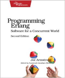

```
Roberto Nogueira  BSd EE, MSd CE
Solution Integrator Experienced - Certified by Ericsson
```

`

# Programming Erlang

## Contents

```
[ ] Introduction

PART 1 WHY ERLANG?
Chapter 1 Introducing Concurrency
[x] Modelling Concurrency
[x] Benefits of Concurrency
[x] Concurrent Programs and Parallel Computers
[x] Sequential vs. Concurrent Programming Languages
Chapter 2 A Whirlwind Tour of Erlang
[x] The shell
[x] Processes, Modules and Compilation
[x] Hello Concurrency
[ ] Exercises

PART 2 SEQUENCIAL PROGRAMMING
Chapter 3 Basic Concepts
[ ] Starting and Stopping the Erlang Shell
[ ] Simple Integer Arithmetic
[ ] Variables
[ ] Floating-Point Numbers
[ ] Atoms
[ ] Tuples
[ ] Lists
[ ] Strings
[ ] Pattern Matching Again
Chapter 4 Modules and Functions
[ ] Modules are where we store code
[ ] Back to Shopping
[ ] Funs: the basic unit of abstraction
[ ] Simple List Processing
[ ] List Comprehensions
[ ] BIFs
[ ] Guards
[ ] case and if Expressions
[ ] Building Lists in Natural Order
[ ] Accumulators
Chapter 5 Records and Maps
[ ] Records are used to name the items in a tuple
[ ] Maps are improved records
[ ] When to Use Maps or Records
Chapter 6 Error Handling in Sequential Programs
[ ] Handling errors in sequential code
[ ] Trapping an Exception with Try…Catch
[ ] Trapping an Exception with Catch
[ ] Programming Style with Exceptions
[ ] Stack Traces
[ ] Fail Fast and Noisily, Fail Politely
Chapter 7 Binaries and the Bit Syntax
[ ] Binaries
[ ] The Bit Syntax
[ ] Bitstrings – Processing Bit-Level Data
Chapter 8 The Rest of Sequential Erlang
[ ] apply
[ ] Arithmetic Expressions
[ ] Arity
[ ] Attributes
[ ] Block Expressions
[ ] Booleans
[ ] Boolean Expressions
[ ] Character Set
[ ] Comments
[ ] Dynamic Code Loading
[ ] Erlang Preprocessor
[ ] Escape Sequences
[ ] Expressions and Expression Sequences
[ ] Function References
[ ] Include Files
[ ] List Operations ++ and – -
[ ] Macros
[ ] Match Operator in Patterns
[ ] Numbers
[ ] Operator Precedence
[ ] The Process Dictionary
[ ] References
[ ] Short-Circuit Boolean Expressions
[ ] Term Comparisons
[ ] Tuple Modules
[ ] Underscore Variables
Chapter 9 Types
[ ] Specifying Data and Function Types
[ ] Erlang Type Notation
[ ] A Session With The Dialyzer
[ ] Type Inference and Success Typing
[ ] Limitations of the Type System

Chapter 10 Compiling and running your program
[ ] Modifying the Development Environment
[ ] Different Ways to Run Your Program
[ ] Automating Compilation with Makefiles
[ ] When Things Go Wrong
[ ] Getting Help
[ ] Tweaking the Environment

PART 3 CONCURRENT AND DISTRIBUTED PROGRAMS
Chapter 11 Real-World Concurrency
Chapter 12 Concurrent Programming
[ ] The Concurrency Primitives
[ ] Introducing Client-Server
[ ] Process Creation Time
[ ] Receive with a Timeout
[ ] Selective Receive
[ ] Registered Processes
[ ] A Word About Tail Recursion
[ ] Spawning with MFAs or Funs
Chapter 12 Errors in Concurrent Programs
[ ] Error handing Philosophy
[ ] Error Handling Semantics
[ ] Creating Links
[ ] Groups of processes which all die togther
[ ] Setting up a firewall
[ ] Monitors
[ ] Error Handling Primitives
[ ] Programming techniques for achieving fault tolerence
Chapter 13 Distributed Programming
[ ] Two Models For Distribution
[ ] Building The Name Server
[ ] Libraries and BIFS for Distributed Programming
[ ] The Cookie Protection System
[ ] Socket-Based Distribution

PART 4 PROGRMMING LIBRARIES AND FRAMEWORKS
Chapter 14 Interfacing Techniques
[ ] How Erlang Communicates With External Programs
[ ] Interfacing an External C Program with a Port
[ ] Calling a Shell Script from Erlang
[ ] Advanced Interfacing Techniques
Chapter 15 Programming with Files
Chapter 16 Modules for Manipulating Files
[ ] Ways to Read a File
[ ] Ways to Write a File
[ ] Directory and File Operations
[ ] Bits and Pieces
[ ] A Find Utility
Chapter 17 Programming with Sockets
[ ] Using TCP
[ ] Active and Passive Sockets
[ ] Error Handling with Sockets
[ ] UDP
[ ] Broadcasting to Multiple Machines
[ ] A SHOUTcast Server
Chapter 18 Interfacing Erlang to the Browser with Websockets
[ ] Six Examples of Controlling the Browser From Erlang
[ ] The Browser-Server Protocol
Chapter 19 Storing data with ETS and DETS
[ ] Types of Table
[ ] ETS Table Efficiency Considerations
[ ] Creating an ETS Table
[ ] Example Programs with ETS
[ ] Storing Tuples on Disk
[ ] What Haven’t We Talked About?
Chapter 20 Mnesia: The Erlang Database
[ ] Creating the Initial Database
[ ] Database Queries
[ ] Adding and Removing Data in the Database
[ ] Mnesia Transactions
[ ] Storing Complex Data in Tables
[ ] Table Types and Location
[ ] The Table Viewer
[ ] Digging Deeper
Chapter 21 Profiling, Debugging, and Tracing
[ ] Tools for Profiling Erlang Code
[ ] Testing Code Coverage
[ ] Generating Cross References
[ ] Compiler Diagnostics
[ ] Runtime Diagnostics
[ ] Debugging Techniques
[ ] The Erlang Debugger
[ ] Tracing Messages and Process Execution
[ ] Frameworks for Testing Erlang Code
Chapter 22 Introducing OTP
[ ] The Road to the Generic Server
[ ] Getting Started with gen_server
[ ] The gen_server Callback Structure
[ ] Code and Templates
[ ] Digging Deeper
Chapter 23 Making a System with OTP
[ ] Generic Event Handling
[ ] The Error Logger
[ ] Alarm Management
[ ] The Application Servers
[ ] The Supervision Tree
[ ] Starting the System
[ ] The Application
[ ] File System Organization
[ ] The Application Monitor
[ ] How Did We Make That Prime?
[ ] Digging Deeper

PART 5 BUILDING APPLICATIONS
Chapter 24 Programming Idioms
[ ] Maintaining the Erlang view of the world
[ ] A Multi-Purpose Server
[ ] Stateful Modules
[ ] Adapter Patterns
[ ] Intentional programming
Chapter 25 Third Party Programs
[ ] Making a Shareable Archive and Managing Your Code With Rebar
[ ] Integrating External Programs With Our Code
[ ] Making a local copy of the dependencies.
[ ] Building Embedded Web Servers with Cowboy
Chapter 26 Programing Multicore CPUs
[ ] Good News for Erlang Programmers
[ ] How to Make Programs Run Efficiently on a Multicore CPU
[ ] Parallelizing Sequential Code
[ ] Small Messages, Big Computations
[ ] Paralleizeing computations with mapreduce
Chapter 27 Sherlock’s Last Case
```
